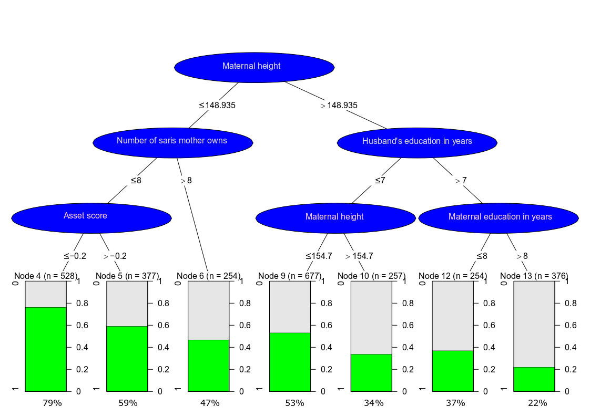

<br>
<br>

#Assignment 1


```{r tree, fig.cap="Figure 1: Decision Tree", message=FALSE, warning=FALSE, paged.print=FALSE,echo=FALSE}

```


<br>
<br>


#Assignment 2


```{r libraries, message=FALSE, warning=FALSE, include=FALSE}
library(gridExtra)
library(tidyverse)
library(plotly)
library(grid)
```

<br>

####1. Function to calculate IQR and outliers 
This function accepts column vector as an argument. Then it calculates the 1st quartile, 3rd quartiles and Inter Quartile Range which is used to compute and return outliers in the column vector.
```{r getoutquant, echo=TRUE, warning=FALSE}
#Function to calculate IQR and permissible outliers 
getoutandquant <- function(x) {
    q1<-quantile(x)[[2]]
    q3<-quantile(x)[[4]]
    IQR<-q3-q1
    
    out1<-q3+(1.5)*IQR
    out2<-q1-(1.5)*IQR
    
#Finding the list of points which are outliers ]
    out<-x[x>out1]
    out2<-x[x<out2]
    outliers<-tibble(x=c(out,out2),y=0)

    return(outliers)
}

```

<br>

####2. Function to plot quantitative variables
The function accepts dataframe,the columns variable name, outlier for the column vector and x-axis label. It then create density plot for the quantitative variable and returns the plot.

```{r plotmodel, echo:TRUE, message=FALSE, warning=FALSE}
#Function to create Density plot of qunatitative variables and marking the outliers.
plotmodel <- function(df2,exp,z,xnames) {

    p1<-ggplot(df2,aes_string(exp)) + stat_density(geom="line") + xlab(xnames)+ylab("Density \n")+ geom_point(data=z,aes(x,y),shape=23)

    return(p1)
}
```


```{r Readtable, message=FALSE, warning=FALSE, include=FALSE}
#Read table
df<- read.table("SENIC.txt",colClasses = c("NULL",
    rep(NA,6),"NULL","NULL",rep(NA,3)))

#Giving names to column
colnames(df)<-c("Length_Stay","Age","Infection_Risk","Culture","Chest_X_ray","No_Beds","Census","Nurses_num","Facility")

```

<br>

####3. Density plot of Infection_Risk column
To generate density plot of Infection_Risk column, two functions - **getoutandquant** and **plotmodel** are used which respectively return the outliers and density plot of the Infection_Risk column.<br>
Analyzing the density plot suggest that more people number acquire infection with probability between 4%  and 5%. Furthermore, there are less number people who has probability of getting infection with value more or less than 4-5. Although more data would be helpful in narrowing why the peak is between 4-5 but intuitvely it can be concluded that naturally in a system there would be less number of people with extremely high and low infection whereas the common infection would be more among people.


```{r infectoutlier, echo=FALSE}
infectoutlier <- getoutandquant(df$Infection_Risk)
plotinfec <-plotmodel(df,"Infection_Risk",infectoutlier,"Infection Risk")
plotinfec

```

```{r modifyingtables, message=FALSE, warning=FALSE, include=FALSE, paged.print=TRUE}
#Since we have evaluated the Infection_risk column we can remove it from the dataframe.
df2 <- df[, colnames(df)!="Infection_Risk"]
le<-length(df2)

#Getting the set of outliers for all quantitative variables
z<-apply(df2,2,getoutandquant)

#Giving names so that a good xlabels values can be shown.
xnames<-c("Length of Stays(Days)","Age(Yrs)","Routine Culture Ratio","Routine Chest_X_ray Ratio","Avg Number of Beds","Average Daily Census","Avg Number of Nurses","Avg Facilities")

#Making a plot of empty list.
myplot <- list()
```

<br>

####4. Density plot and analysis of all quantitative variable
* Density plot for average length of stay(in days) for all patients is right skewed with more people staying at hospital between 8-10 days and thereafter the graph plummets down and stays constant around 1 days. There are three outliers(19.6,13.9,17.9) which might point that those hospitals treats cases with severe problem.
<br>
* Density plot for average Age, Routine Chests X ray ratio(in percent) and average Facilities at hospital seems symmetric. 
<br>
       +  More patients between 50-55(approx) age seems to visit each hospital.
       +  Regarding Chest X ray , it seems most of the hospitals did X-ray check up upto (80-90)%  and some hospitals did more X rays(134%). It is very well possible that most of the  patients might be doing xrays or only some patients might have done more than one X ray.
       +  Average facility and services provided by all hospitals is concentrated around 30% to 50% of 35 facility. At first glance it might seem that hospital have not used all facility to full use but it can be very well contented that those hospital might have not required to use its full facility to diagnose the visiting patient. More details would be helpful in concluding it.
<br> 
* Routine Culture Ratio(in percent), average number of beds, average daily census and number of nurses are rightly skewed. 

```{r plotmodels, echo=FALSE}
for (i in 1:le) {
    myplot[[i]]<-plotmodel(df2,colnames(df2)[i],z[[i]],xnames[i])
}

title=textGrob("Density Plot of SENIC Datasets",gp=gpar(fontface="bold"))

grid.arrange(grobs=c(list(plotinfec),myplot),top=title)
```

<br>

####5. Graph from ggplot2 to plotly
Converted the graph from ggplot2 to plotly using ggplotly function. The benefit of using ggplotly is that we can hover around the graph and see the values. The amount of information is more available than using ggplot2.

```{r useplotly, echo=FALSE}
ggplotly(plotinfec)

```

<br>

####6. Scatterplot between number of nurses and infection risk 
Using scatterplot to find relation between number of nurses and infection risk based on number of beds informs that irrespective of the average number of beds or nurses, most of the patient will acquire infection from hospitals with probability of 0.04% to 0.06% . Additonally the average number of beds do increase with number of nurses which might possible suggest that, that particular hospitals corresponding to more nurses deals with more patients. The possible danger with using this scatterplot with color scale is difficult to make distinction and the clear boundaries are not set. 

```{r useggplot, echo=FALSE}
sp<-ggplot(df,aes(Nurses_num,Infection_Risk,color=No_Beds)) +geom_point() + xlab("\n Number of Nurses") + ylab("Infection risk\n")
sp+scale_color_gradientn(colours = rainbow(5))
```


<br>

####7. Histogram of Infection_Risk column without ggplot2
Without using ggplot2, a histogram of Infection_risk column is generated with plotly, pipeline and various arguments. From the histogram , it can be seen that most number of people tends to get infection with probability around 4% to 5%. Furthermore, the diamond shape points represent the outliers in the histogram. 
```{r usingplotly, echo=FALSE}
x<-as.list(infectoutlier[,1])

plot_ly(x= ~df$Infection_Risk,type="histogram",name="Histogram",marker=list(line=list(color="black",width=1)))%>% add_markers(x=x[[1]],y=0,name="Outliers",marker=list(symbol="diamond",size=7))%>% layout(title="Histogram of Infection Risk",xaxis=list(title="Infection Risk"),yaxis=list(title="Frequency"))

```

<br>

####8. Shiny app to dynamically generate all plots.
Dynamic plot is generated for all graph using shiny app. On checking the optimal bandwidth, it is seen that the information gets scrambled when the bandwidth is too low whereas there is a loss of information if the bandwdith becomes too large. The optimal bandwidth to see all graph is around 2.1 .
```{r shiny, eval=FALSE,echo=TRUE}
library(shiny)
library(ggplot2)
library(tidyverse)


df<- read.table("SENIC.txt",colClasses = c("NULL",
    rep(NA,6),"NULL","NULL",rep(NA,3)))

#Giving names to column
colnames(df)<-c("Length_Stay","Age","Infection_Risk","Culture","Chest_X_ray",
               "No_Beds","Census","Nurses_num","Facility")


ui<-fluidPage(
    
    titlePanel("Density Plots of Quantitative Variables"),
    sidebarLayout( sidebarPanel( sliderInput("bw","Slide to change bandwidth 
                   of Plot",min=0.1,max=10,value=3,step=0.2,animate=TRUE),
                                 
                   checkboxGroupInput("variableinp","Choose variables",
                   choices=colnames(df),selected = colnames(df)[1]),verbatimTextOutput("value")
                   ),
                   mainPanel( plotOutput("densityplot"))
        )
)


server<-function(input,output){
    
    # observeEvent(input$variableinp, {
    #      print((input$variableinp))
    #  })
        
    output$densityplot <- renderPlot({
        
        if(!is.null(input$variableinp)) {
            
        getoutandquant <- function(x) {
            q1<-quantile(x)[[2]]
            q3<-quantile(x)[[4]]
            IQR<-q3-q1
            
            out1<-q3+(1.5)*IQR
            out2<-q1-(1.5)*IQR
            
            #Finding the list of points which are outliers for a particular variable.
            out<-x[x>out1]
            out2<-x[x<out2]
            outliers<-tibble(x=c(out,out2),y=0)
            
            return(outliers)
        }
            nplot<-length(input$variableinp)
            x<-input$variableinp
            
            p<-list()
            for ( i in 1:nplot) {
                outlier<-getoutandquant(df[,x[i]])
                
                 p[[i]]<-ggplot(df,aes_string(x[i]))+
                 stat_density(geom="line",adjust=input$bw)+ ylab("Density\n")+
                     geom_point(data=outlier,aes(x,y),shape=23)

            }
            
            do.call(grid.arrange,p)
        }
    })
}


shinyApp(ui=ui,server=server)
```

<br>

<br>

<br>


### Appendix
```{r append, ref.label= c("tree","libraries" ,"plotmodel", "Readtable", "infectoutlier", "modifyingtables", "plotmodels", "useggplot", "usingplotly","usingshiny"), eval= FALSE}
```

