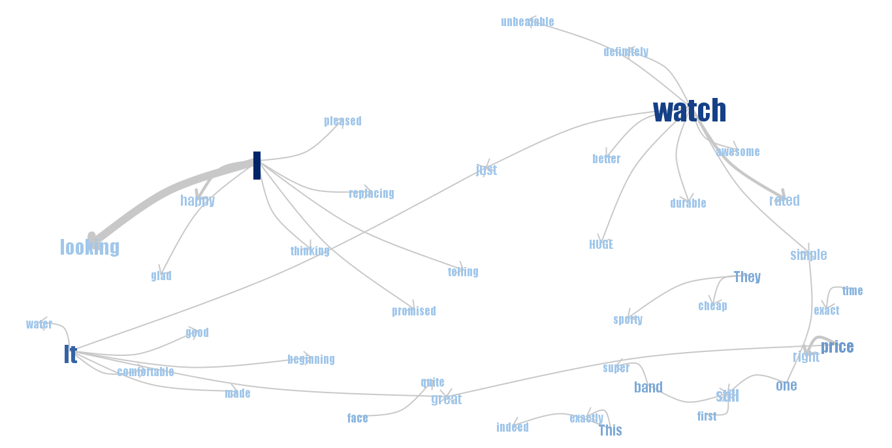
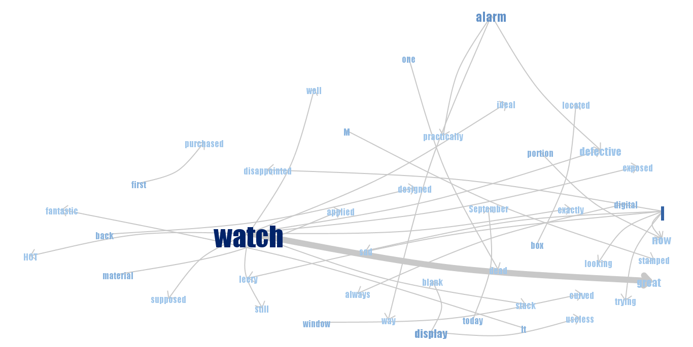
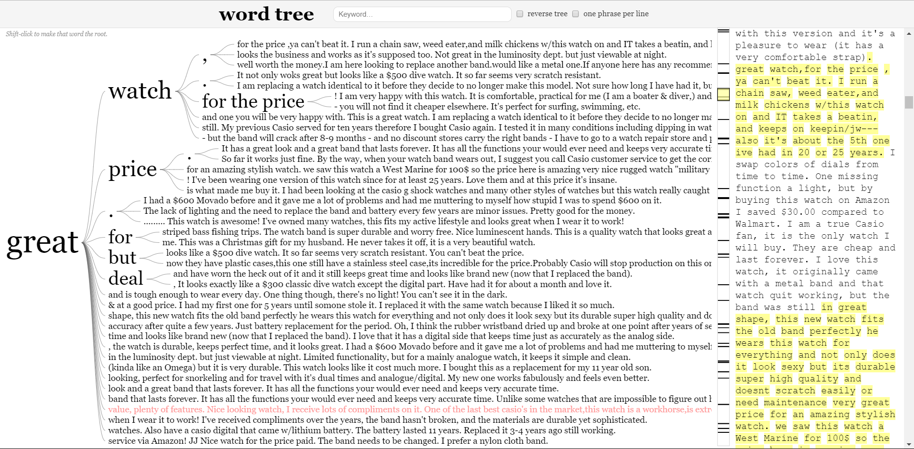
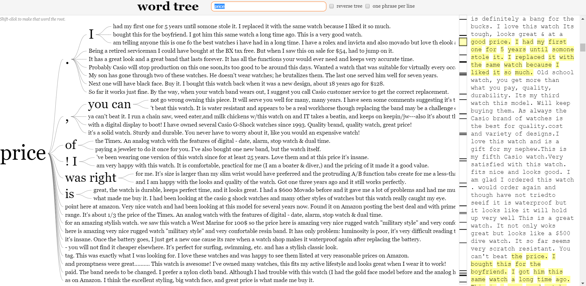
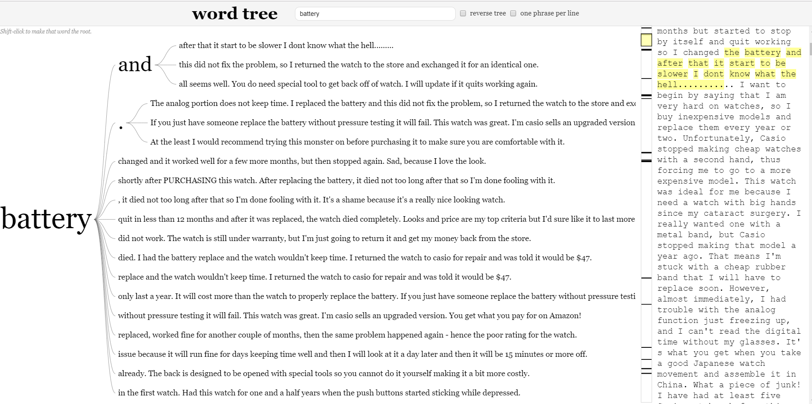
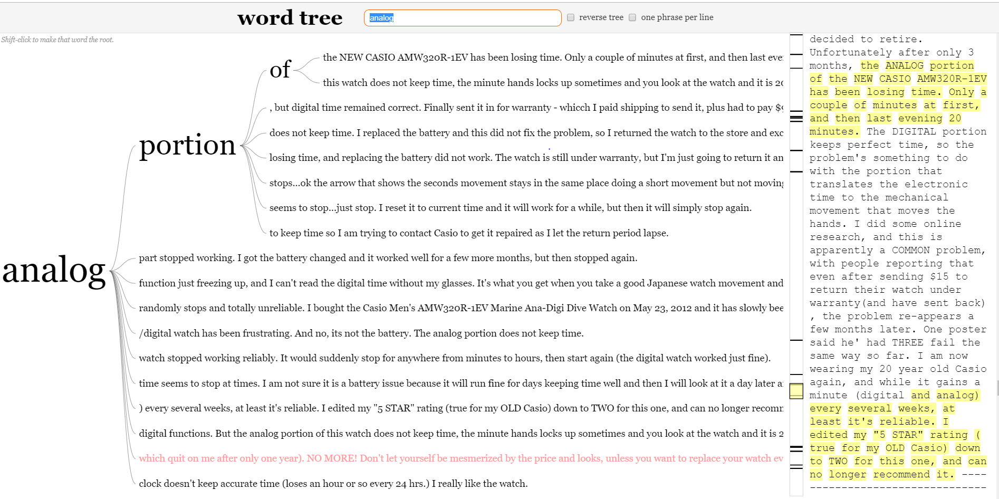
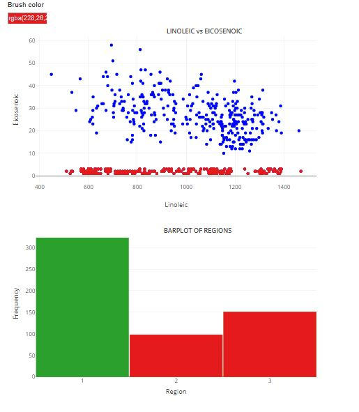
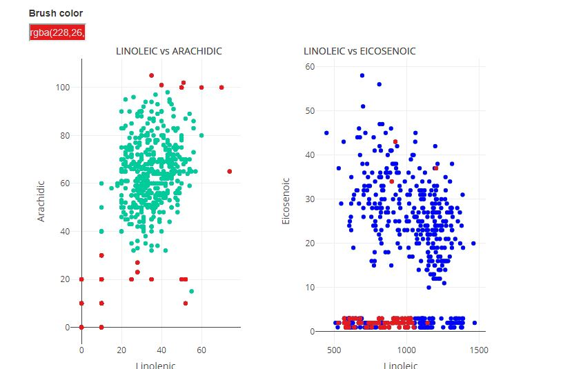
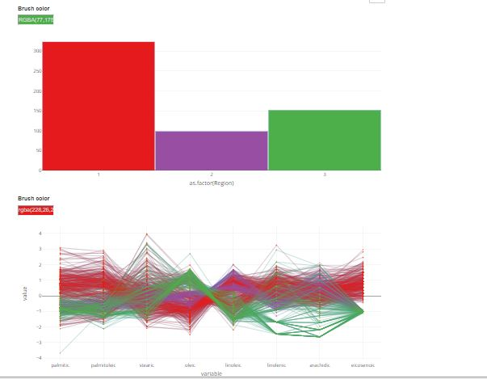
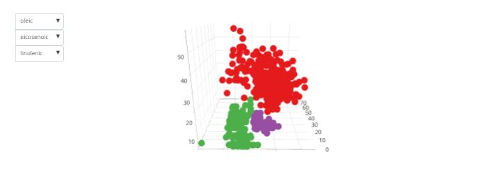

<br>

<br>

#Assignment-1
```{r message=FALSE, warning=FALSE}
library(tm)
library(wordcloud)
library(NLP)
library(RColorBrewer)
library(png)
library(plotly)
library(crosstalk)
library(tidyverse)
library(GGally)
library(htmltools)

```
###Reading the Files Five.txt and OneTwo.txt
```{r message=FALSE, warning=FALSE}
#Read File Five.txt

Word_C1<-read.table("Five.txt",header=F, sep='\n')

#Read File OneTwo.txt

Word_C2<-read.table("OneTwo.txt",header = F,sep = '\n')

```

#1 Wordcloud

###wordcloud-Five

  In the graph word cloud-Five, we can analyze the words which are frequently repeated in the text. For example, we can see in the graph the first-word "Watch" looks bigger with certain color because the word watch is repeated more times and the frequency of the watch is high(156). And take the second word "One" it appears with a different color because after the word "watch" the word "One" contains high frequency(67). It depends upon the coloring based upon 'pal' function it will search the word with high frequency and allocate certain color to the word.The graph is also showing some postive words which are frequently used by the customers such as good, great, looks nice, band ,digital,durable, display,quality,new dial,analog, servic etc.It easier to identify the 


```{r message=FALSE, warning=FALSE}
Word_C1$doc_id=1:nrow(Word_C1)
colnames(Word_C1)[1]<-"text"
mycorpus <- Corpus(DataframeSource(Word_C1)) 
mycorpus <- tm_map(mycorpus, removePunctuation)
mycorpus <- tm_map(mycorpus, function(x) removeWords(x, stopwords("english")))
tdm <- TermDocumentMatrix(mycorpus)
C1_M<- as.matrix(tdm)
C1_row <- sort(rowSums(C1_M),decreasing=TRUE)
d <- data.frame(word = names(C1_row),freq=C1_row)
pal <- brewer.pal(10,"Dark2")
pal <- pal[-(1:2)]
wordcloud(d$word,d$freq, scale=c(8,.3),min.freq=2,max.words=100, random.order=F, rot.per=.15, colors=pal, vfont=c("serif","oblique cyrillic"))

```

###wordcloud-OneTwo
  In the graph, the word cloud OneTwo we can analyze the words contains high frequency like "Watch"(121) assigned to black color and the words "casino" &"time" contains frequency (37) so the words assigned with the same color. In the graph, we can see the properties of watch-like battery, display but we cannot understand whether the customer reviewed these properties in the positive or negative way. There are also some words in the graph like replacement, problem, stopped, loosing, which indicates negative reviews.
  
  
```{r message=FALSE, warning=FALSE}

Word_C2$doc_id=1:nrow(Word_C2)
colnames(Word_C2)[1]<-"text"
mycorpus <- Corpus(DataframeSource(Word_C2)) 
mycorpus <- tm_map(mycorpus, removePunctuation)
mycorpus <- tm_map(mycorpus, function(x) removeWords(x, stopwords("english")))
tdm <- TermDocumentMatrix(mycorpus)
C2_M<- as.matrix(tdm)
C2_row <- sort(rowSums(C2_M),decreasing=TRUE)
d <- data.frame(word = names(C2_row),freq=C2_row)
pal <- brewer.pal(10,"Dark2")
pal <- pal[-(1:2)]
wordcloud(d$word,d$freq, scale=c(8,.3),min.freq=2,max.words=100, random.order=F, rot.per=.15, colors=pal, vfont=c("serif","oblique cyrillic"))


```

#2 Phrasenet

###Phrasenet-Five

```{r phrasenet-Five}
#phrasenet-Five-image




```

###Phrasenet-OneTwo

```{r}
#phrasenet-OneTwo-image



```

#3 WordTree

```{r}
 #Five.txt-wordtree




#One-Two.txt-wordtree




```


###Which properties of this watch are mentioned mostly often?
  
  The  properties of the watch  mentioned most often are rugged looking,big watch face,stylish and good looking,great price, very durable, water resistant, well worth money, band is good, digital function, battery replacement, scratch resistant, stainless steel case, the electronic portion, push button, alarm sound etc.
 

###What are satisfied customers talking about?

  According to the satisfied customers, reviews are the is nice and good looking with the band that lasts forever in a great shape, the watch gives a lot of extras like dual time,perpetual calendar and alarm comes in very handy. The pricing of the watch made it a good value. It fits nice, looks stylish and feels comfortable.It originally came with a metal band and durable with high quality and doesn't scratch easily, rugged looking , feel nice,very durable,
  
  The watch is water resistant and semi-reflective texture of the dial itself. Casio makes this watch with atomic movement and lighted dial.It contains digital and analog features with great price.The watch luminescence is strong and it is very readable at night. Simple to figure the time without any instructions. It contains a stainless steel case.It is excellent styling with big watch face and contains battery replacement option and the life of the battery comes around 2 years. The watch rugged with military style. The watch contains lithium battery and made up of scratch resistant. It shrugs off casual water from boating and dishwashing.This is a great watch well worth the money and suitable for virtually every occasion. In a watch, date changes automatically.
  

###What are unsatisfied customers talking about?

   According to unsatisfied customers, reviews are the analog part in watch stop working and lost time. After replacing the battery the watch is not working. The watch will work for a while after reset but then it will simply stop again this problem reappears a few months later. The alarm sound is not louder. The analog and digital functions of the watch are very bad. It is difficult to tell the time in the dark. The watch works the first few months and then it stops working. The battery quits less than 12 months and after it was replaced, the watch died completely. The quality of the watch is poor. The push buttons started sticking while depressed and contain cheap plastic.
  
  The watch electronic panel and second hands frequently stop working. Even though the watch is resistant to water it will stop working once it comes in to contact with water. The watch still randomly slows and then runs well for many days. The watch is not worth repairing because of the price of cheaper. The digital portion keeps perfect time and sometimes the problem is with the electronic panel. Difficulty in replacement of watch.The watch classy and rugged looking.
   
###What are good and bad properties of the watch mentioned by both groups?  
 
  *Good properties:-  looks good and stylish, rugged looking,great price,easy to analyze time,  good quality of band with great shape,water resistant, digital function is good,design of the watch is good,comfortable while useing and very durable.
 
 *Bad properties:-   No light,losing or gaining time,battery replacement,the watch analog function is not working.
 
 
### Can you understand watch characteristics (like type of display, features of the watches) by observing these graphs?
 
  Analyzing these graphs like "word cloud", "phrase net", "world tree", we can see words like digital, analog, electronic, big face, dial, version etc. From word cloud, we can understand functions of display of the watch but in phrase net graph we cannot identify and in word tree, we can understand how the display works. The features of the watch are good quality, great price, water resistant, great shape, very durable, battery replacement,semi-reflective texture etc. From word tree, we can analyze the features easily compare to word cloud and phrase net graphs. From the above analysis, Yes I can understand the characteristics like type of display and features of the watch.  
  
    

<br>
<br>
<br>


#Assignment 2

```{r message=FALSE, warning=FALSE}
library(plotly)
library(crosstalk)
library(tidyverse)
library(GGally)
library(htmltools)
```


###1. Scatter Plot
Many of the Eicosenoic values are low, lower than 3. The range for lower value of Eicosenoic is from 1 to 3. The values of Eicosenoic is well spread out from 510-1470 for the value of Linoleic.
```{r ques1, message=FALSE, warning=FALSE}
olivedata<-read.csv("olive.csv")
olivedata$Region<-as.factor(olivedata$Region)

dshared<-SharedData$new(olivedata)

sct<-dshared %>% plot_ly(x=~linoleic,y=~eicosenoic,type="scatter") %>% layout(xaxis=list(title="Linoleic"),yaxis=list(title="Eicosenoic"),annotations=list(
  text = "LINOLEIC vs EICOSENOIC",
  xref = "paper",
  yref = "paper",
  yanchor = "bottom",
  x = 0.6,
  y = 1,showarrow=FALSE,
  font=list(face="bold",size="14")
)) %>% add_markers(color = I("blue"))
sct
```


###2. Link Scatter to Bar
+ Using persistent brushing, it can be seen that the low value of Eicosenoic belongs to Region 2 and 3. Additionaly, for value of Linoleic from 510-1000, most of the Eicosenoic belongs to region 3 and for value of linoleic after 1000, most of the eicosenoic belong to region 2.
Moroever most of the Eicosenoic value comes from Region 1. The number of Eicosenoic value from Region 1 is more than Region 2 and 3 combined.


+ For value of stearic between 152-198 there is no Eiconsenoic value from Region 2. Moreover as the value of stearic increases, it can be seen that most of the Eicosenoic value tends to have high value greater than 1000. As stearic value keep increasing past 250-260 range, most of the Eicosenoic value tends have value lesser than 1000.


+ Selection,connection,filtering are the interaction operators used.
```{r ques2, message=FALSE, warning=FALSE}

barplt<-plot_ly(dshared,x=~Region,height=800,type="histogram") %>% layout(bargap=0.01,barmode="overlay",xaxis=list(title="Region"),yaxis=list(title="Frequency"),annotations=list(
  text = "BARPLOT OF REGIONS",
  xref = "paper",
  yref = "paper",
  x = 0.7,
  y = 1,showarrow=FALSE,
  font=list(size=14,face="bold")
)) 

subplt<-subplot(sct,barplt,margin=0.07,titleX=TRUE,titleY=TRUE,nrows=2) %>% highlight(on="plotly_select",dynamic=T,persistent = T,opacityDim = I(1))%>%hide_legend()

bscols(widths=c(3,NA), filter_slider("se","Stearic",dshared,~stearic),subplt)

```
<br>
<br>

Below figure shows the persistent brushing on lower value of eicosenoic region in scatterplot which reveals that the lower value of Eicosenoic comes from region 2 and region 3. 
```{r}

```


###3. Link Scatter plots
The outliers in (arachidic, linolenic) are values below 35 and 60 for arachidic and linolenic repsectively. Other range of outliers can be considered above 100 for arachidic. For the outliers the outliers in(eicosenoic, linoleic) graph can be seen for Eicosenoic for value lesser than 4 and linoleic value lesser than 1000. 

For the outliers in (arachidic, linolenic) the corresponding outliers can be seen as cluster in (eicosenoic, linoleic) graph
```{r message=FALSE, warning=FALSE}

d2<-SharedData$new(olivedata)


sct<-d2 %>% plot_ly(x=~linoleic,y=~eicosenoic,type="scatter") %>% layout(xaxis=list(title="Linoleic"),yaxis=list(title="Eicosenoic"),annotations=list(
  text = "LINOLEIC vs EICOSENOIC",
  xref = "paper",
  yref = "paper",
  yanchor = "bottom",
  x = 0.6,
  y = 1,showarrow=FALSE,
  font=list(face="bold",size="14")
)) %>% add_markers(color = I("blue"))


sct1 <-
    plot_ly(d2,
    x =  ~ linolenic,
    y =  ~ arachidic,
    type = "scatter") %>% layout(xaxis = list(title = "Linolenic"),
    yaxis = list(title = "Arachidic"),annotations=list(
    text = "LINOLEIC vs ARACHIDIC",
    xref = "paper",
    yref = "paper",
    yanchor="bottom",
    xanchor="right",
    x = 0.9,
    y = 1,showarrow=FALSE,
    font=list(size=14,face="bold"))) %>% add_markers(color = I("#00cc99"))

subplot(sct1,sct,titleX=TRUE,titleY=TRUE,margin=0.09) %>% highlight(on = "plotly_select",
                                 dynamic = T,persistent=T,
                                 opacityDim = I(1))%>%hide_legend()

```


In Below figure,the use of different color brush reveals corresponding outliers between (arachidic, linolenic) and (eicosenoic, linoleic) scatter plots.
```{r}

```

<br>
<br>

###4. Linked plots

**Does the parallel coordinate plot demonstrate that there are clusters among the observations that belong to the same Region?**
Upon coloring the bar plot, it can be seen that the there are clusters from Region 2 which can be seen by variable linolenic and oleic. Similarly clusters can be seen for Region 1 by  linolenic and lenoleic variable. For Region 3, there seems to be no proper cluster.

**Select the three influential variables in the drop boxes and observe in the 3d-plot whether each Region corresponds to one cluster.**
We found that oleic, linolenic and eicosenoic were the infuential variables which was usefull in representing one cluster per region.

```{r message=FALSE, warning=FALSE}

p <- ggparcoord(olivedata, columns = c(4:ncol(olivedata)))
d <- plotly_data(ggplotly(p))%>%group_by(.ID)

d1 <- SharedData$new(d, ~ .ID, group = "olives")

p1 <- plot_ly(d1, x =  ~ variable, y =  ~ value) %>% add_lines(line = list(width =
      0.3)) %>% add_markers(marker = list(size = 0.3),
      text =  ~ .ID,
      hoverinfo = 'text')

#Linked 3D scatter plot

olivedatadup<-olivedata
d3<-SharedData$new(olivedatadup, group="olives")


buttonx = list()
for (i in 4:ncol(olivedata)) {
buttonx[[i - 3]] <- list(
method = 'restyle',
args = list("x", list(olivedata[[i]])),
label = colnames(olivedata)[i])
}

buttony = list()
for (i in 4:ncol(olivedata)) {
buttony[[i - 3]] <- list(
method = 'restyle',
args = list("y", list(olivedata[[i]])),
label = colnames(olivedata)[i])
}
 

buttonz = list()
for (i in 4:ncol(olivedata)) {
buttonz[[i - 3]] <- list(
method = 'restyle',
args = list("z", list(olivedata[[i]])),
label = colnames(olivedata)[i])
}

pltthreed <- plot_ly(
             d3,
             x =  ~ linoleic,
             y =  ~ palmitoleic,
             z =  ~ stearic,
             alpha = 0.8 ) %>%  
             add_markers() %>%
             layout(scene=list(
             xaxis = list(title = ""),
             yaxis = list(title = ""),
             zaxis = list(title = "")),
             title = "Select variable:",
             updatemenus = list(
             list(y = 0.9, buttons = buttonx),
             list(y = 0.8, buttons = buttony),
             list(y = 0.7, buttons = buttonz)
             )
              )
    
#Variable selection barchart
barplt<-plot_ly(d3,x=~as.factor(Region),type="histogram") %>% layout(bargap=0.01,barmode="overlay")

ps <-
    tagList(
    barplt %>% highlight(
    on = "plotly_select",
    dynamic = T,
    persistent = T,
    opacityDim =    I(1)
    ) %>% hide_legend(),
    
    p1 %>% highlight(
    on = "plotly_select",
    dynamic = T,
    persistent = T,
    opacityDim = I(1)
    ) %>% hide_legend(),
    
    pltthreed %>% highlight(
    on = "plotly_select",
    dynamic = T,
    persistent = T,
    opacityDim = I(1)
    ) %>% hide_legend()
    )


htmltools::browsable(ps)  
```


Below figure shows the colored parallel coordinate based on region
```{r}

```

Oleic, Linolenic and Eicosenoic as three influential variable which shows three cluster where each cluster belong to one region. 
```{r}

```
<br>

5. * Interaction Operators:
        + Navigation Operator: We could rotate, zoom the 3d-scatter plot
        + Selection Operator : Selecting the barplot
        + Encoding: Changing the color.
        + Connecting Operator
        + Reconfiguring Oeprator: The way we can select different variables in 3d plot
 
  * Interaction Operands:
        + In Screen Space: Navigation, because we can zoom and rotate and pa 3d plot
        + In Data Structure Space:Reconfiguring Operators and Selection , because we try to                          identify the pattern in data.
        + In attribute space: Encoding since we change the colors and Navigation, since we can zoom the 3d scatter plot
        
**Question: Which additional interaction operators can be added to the visualization in step 4 to make it even more efficient/flexible?**

Reconfiguring operator to reorder the variables in parallel coordinate would be helpfull.

**Question: Based on the analysis in the previous steps, try to suggest a strategy (or, maybe, several strategies) that would use information about the level of acids to discover which regions different oils comes from.**

One fo stratergy would be to provide filtering operator for all level of acids. The flitering operator should be linked to paralle plot and scatter plot. Based on selecting particular range of acids the cluster could be well identified in 3d-scatter plot and paralle plot.

#Appendix

##Assignment 1
```{r,eval=FALSE}
library(tm)
library(wordcloud)
library(NLP)
library(RColorBrewer)
library(png)
library(plotly)
library(crosstalk)
library(tidyverse)
library(GGally)
library(htmltools)


#Read File Five.txt

Word_C1<-read.table("Five.txt",header=F, sep='\n')

#Read File OneTwo.txt

Word_C2<-read.table("OneTwo.txt",header = F,sep = '\n')


Word_C1$doc_id=1:nrow(Word_C1)
colnames(Word_C1)[1]<-"text"
mycorpus <- Corpus(DataframeSource(Word_C1)) 
mycorpus <- tm_map(mycorpus, removePunctuation)
mycorpus <- tm_map(mycorpus, function(x) removeWords(x, stopwords("english")))
tdm <- TermDocumentMatrix(mycorpus)
C1_M<- as.matrix(tdm)
C1_row <- sort(rowSums(C1_M),decreasing=TRUE)
d <- data.frame(word = names(C1_row),freq=C1_row)
pal <- brewer.pal(10,"Dark2")
pal <- pal[-(1:2)]
wordcloud(d$word,d$freq, scale=c(8,.3),min.freq=2,max.words=100, random.order=F, rot.per=.15, colors=pal, vfont=c("serif","oblique cyrillic"))


Word_C2$doc_id=1:nrow(Word_C2)
colnames(Word_C2)[1]<-"text"
mycorpus <- Corpus(DataframeSource(Word_C2)) 
mycorpus <- tm_map(mycorpus, removePunctuation)
mycorpus <- tm_map(mycorpus, function(x) removeWords(x, stopwords("english")))
tdm <- TermDocumentMatrix(mycorpus)
C2_M<- as.matrix(tdm)
C2_row <- sort(rowSums(C2_M),decreasing=TRUE)
d <- data.frame(word = names(C2_row),freq=C2_row)
pal <- brewer.pal(10,"Dark2")
pal <- pal[-(1:2)]
wordcloud(d$word,d$freq, scale=c(8,.3),min.freq=2,max.words=100, random.order=F, rot.per=.15, colors=pal, vfont=c("serif","oblique cyrillic"))


```


##Assignment 2
```{r,eval=FALSE}
###1. Scatter Plot
olivedata<-read.csv("olive.csv")
olivedata$Region<-as.factor(olivedata$Region)

dshared<-SharedData$new(olivedata)

sct<-dshared %>% plot_ly(x=~linoleic,y=~eicosenoic,type="scatter") %>% layout(xaxis=list(title="Linoleic"),yaxis=list(title="Eicosenoic"),annotations=list(
  text = "LINOLEIC vs EICOSENOIC",
  xref = "paper",
  yref = "paper",
  yanchor = "bottom",
  x = 0.6,
  y = 1,showarrow=FALSE,
  font=list(face="bold",size="14")
)) %>% add_markers(color = I("blue"))
sct


barplt<-plot_ly(dshared,x=~Region,height=800,type="histogram") %>% layout(bargap=0.01,barmode="overlay",xaxis=list(title="Region"),yaxis=list(title="Frequency"),annotations=list(
  text = "BARPLOT OF REGIONS",
  xref = "paper",
  yref = "paper",
  x = 0.7,
  y = 1,showarrow=FALSE,
  font=list(size=14,face="bold")
)) 

subplt<-subplot(sct,barplt,margin=0.07,titleX=TRUE,titleY=TRUE,nrows=2) %>% highlight(on="plotly_select",dynamic=T,persistent = T,opacityDim = I(1))%>%hide_legend()

bscols(widths=c(3,NA), filter_slider("se","Stearic",dshared,~stearic),subplt)


d2<-SharedData$new(olivedata)


sct<-d2 %>% plot_ly(x=~linoleic,y=~eicosenoic,type="scatter") %>% layout(xaxis=list(title="Linoleic"),yaxis=list(title="Eicosenoic"),annotations=list(
  text = "LINOLEIC vs EICOSENOIC",
  xref = "paper",
  yref = "paper",
  yanchor = "bottom",
  x = 0.6,
  y = 1,showarrow=FALSE,
  font=list(face="bold",size="14")
)) %>% add_markers(color = I("blue"))


sct1 <-
    plot_ly(d2,
    x =  ~ linolenic,
    y =  ~ arachidic,
    type = "scatter") %>% layout(xaxis = list(title = "Linolenic"),
    yaxis = list(title = "Arachidic"),annotations=list(
    text = "LINOLEIC vs ARACHIDIC",
    xref = "paper",
    yref = "paper",
    yanchor="bottom",
    xanchor="right",
    x = 0.9,
    y = 1,showarrow=FALSE,
    font=list(size=14,face="bold"))) %>% add_markers(color = I("#00cc99"))

subplot(sct1,sct,titleX=TRUE,titleY=TRUE,margin=0.09) %>% highlight(on = "plotly_select",
                                 dynamic = T,persistent=T,
                                 opacityDim = I(1))%>%hide_legend()


p <- ggparcoord(olivedata, columns = c(3:ncol(olivedata)))
d <- plotly_data(ggplotly(p))%>%group_by(.ID)

d1 <- SharedData$new(d, ~ .ID, group = "olives")

p1 <- plot_ly(d1, x =  ~ variable, y =  ~ value) %>% add_lines(line = list(width =
      0.3)) %>% add_markers(marker = list(size = 0.3),
      text =  ~ .ID,
      hoverinfo = 'text')

#Linked 3D scatter plot

olivedatadup<-olivedata
olivedatadup$.ID <- 1:nrow(olivedatadup)
d3<-SharedData$new(olivedatadup, ~.ID, group="olives")


buttonx = list()
for (i in 4:ncol(olivedata)) {
buttonx[[i - 3]] <- list(
method = 'restyle',
args = list("x", list(olivedata[[i]])),
label = colnames(olivedata)[i])
}

buttony = list()
for (i in 4:ncol(olivedata)) {
buttony[[i - 3]] <- list(
method = 'restyle',
args = list("y", list(olivedata[[i]])),
label = colnames(olivedata)[i])
}
 

buttonz = list()
for (i in 4:ncol(olivedata)) {
buttonz[[i - 3]] <- list(
method = 'restyle',
args = list("z", list(olivedata[[i]])),
label = colnames(olivedata)[i])
}

pltthreed <- plot_ly(
             d3,
             x =  ~ linoleic,
             y =  ~ palmitoleic,
             z =  ~ stearic,
             alpha = 0.8 ) %>%  
             add_markers() %>%
             layout(scene=list(
             xaxis = list(title = ""),
             yaxis = list(title = ""),
             zaxis = list(title = "")),
             title = "Select variable:",
             updatemenus = list(
             list(y = 0.9, buttons = buttonx),
             list(y = 0.8, buttons = buttony),
             list(y = 0.7, buttons = buttonz)
             )
              )
    
#Variable selection barchart
barplt<-plot_ly(d3,x=~as.factor(Region),type="histogram") %>% layout(bargap=0.01,barmode="overlay")

ps<-tagList(pltthreed %>% highlight(on="plotly_select",dynamic=T,persistent=T,opacityDim = I(1))%>% hide_legend(),
            p1%>% highlight(on="plotly_select",dynamic=T,persistent=T,opacityDim = I(1))%>%hide_legend(),
            barplt %>% highlight(on="plotly_select",dynamic=T,persistent=T,opacityDim = I(1))%>%hide_legend()
            )


htmltools::browsable(ps)  
 
```


